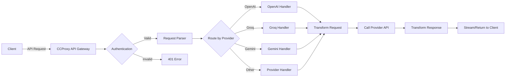
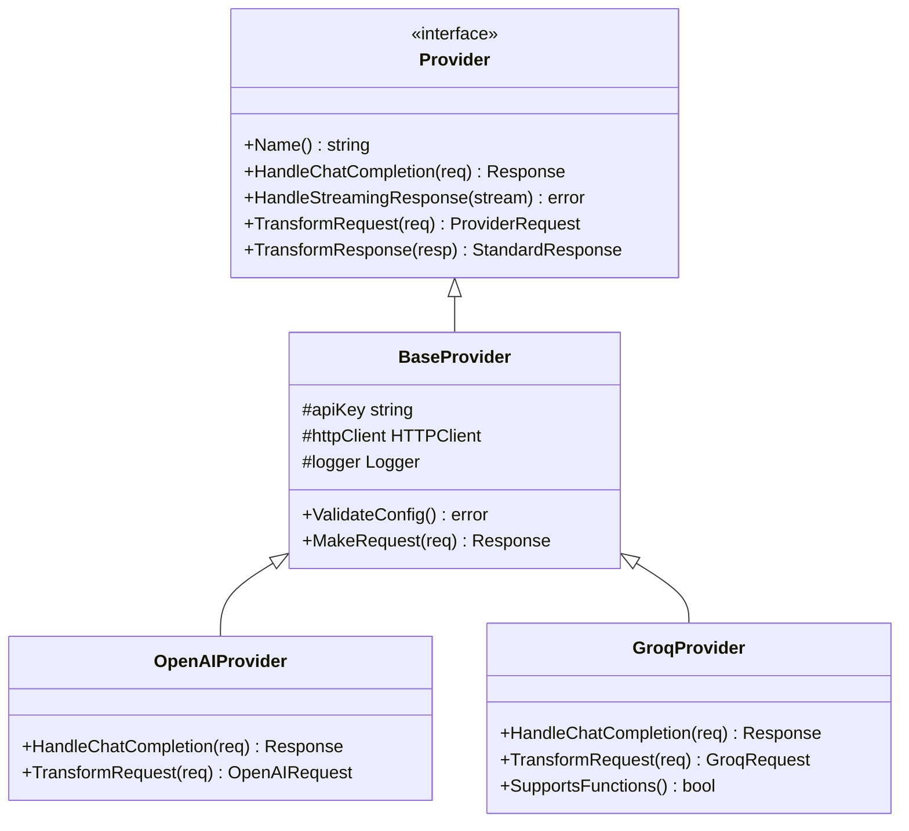
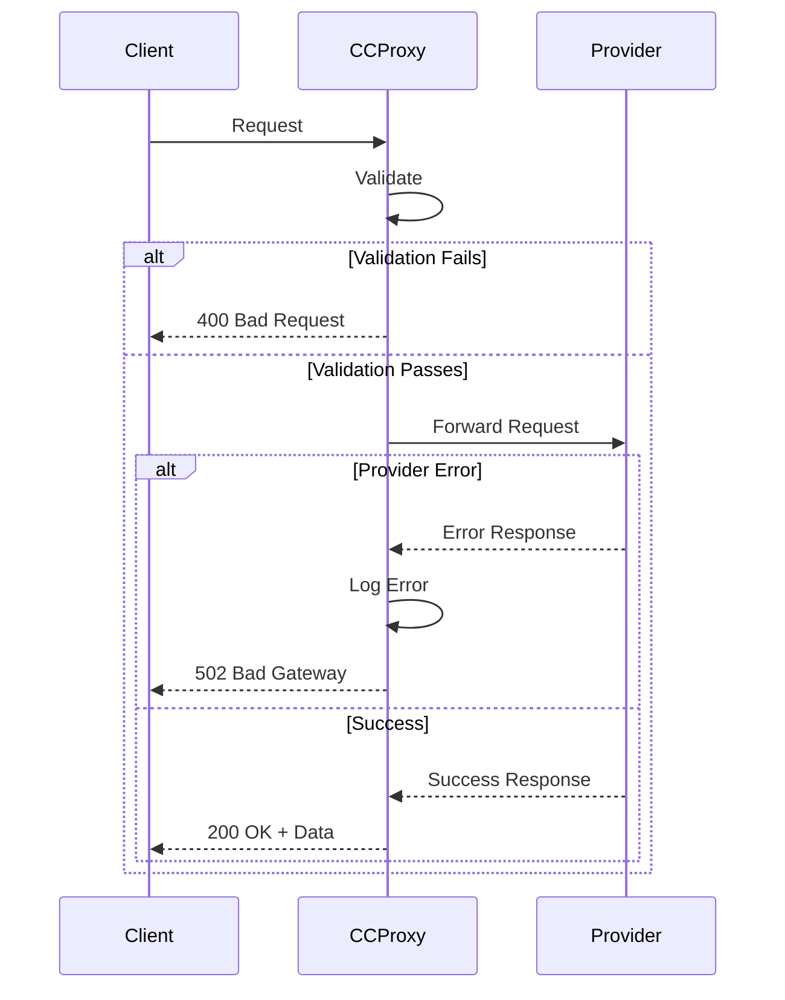
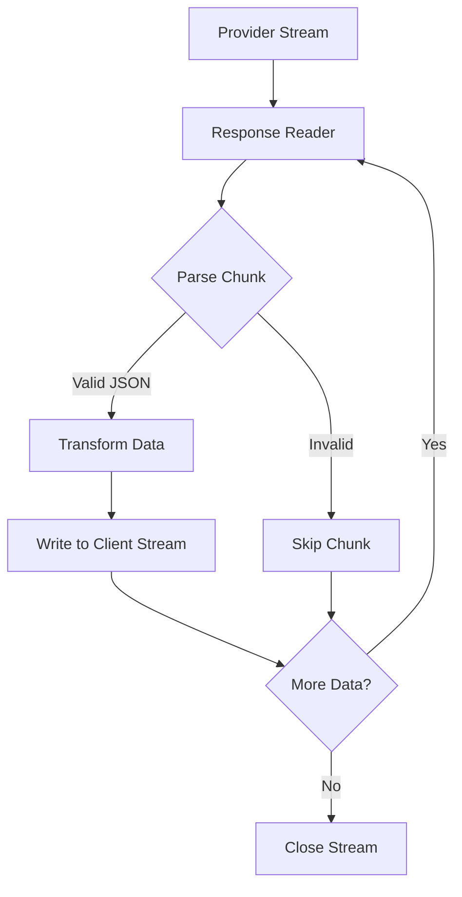
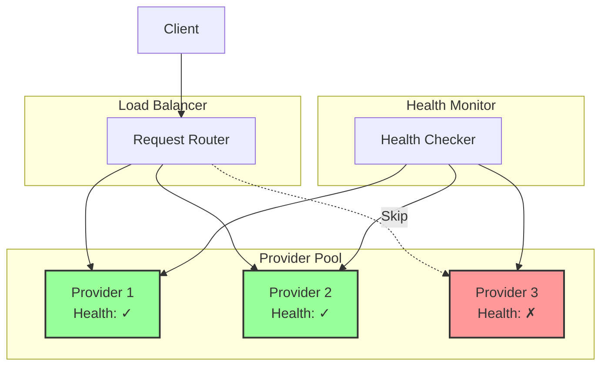

# API Architecture

CCProxy provides a unified interface for multiple AI providers through a carefully designed architecture.

## Request Flow

The following diagram shows how requests flow through CCProxy:

## Provider Architecture

Each provider follows a common interface pattern:

## Error Handling Flow

## Streaming Response Architecture

## Load Balancing Strategy

