# API Architecture

CCProxy provides a unified interface for multiple AI providers through a carefully designed architecture with comprehensive security, performance monitoring, and testing capabilities.

## System Architecture

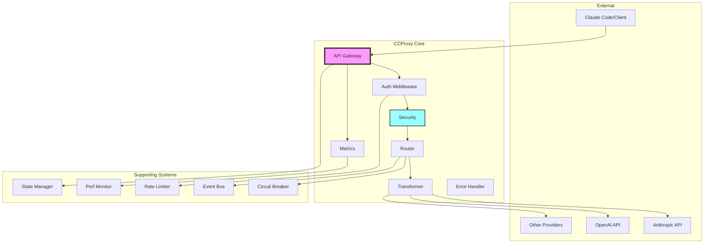

## Request Flow

The following diagram shows how requests flow through CCProxy:

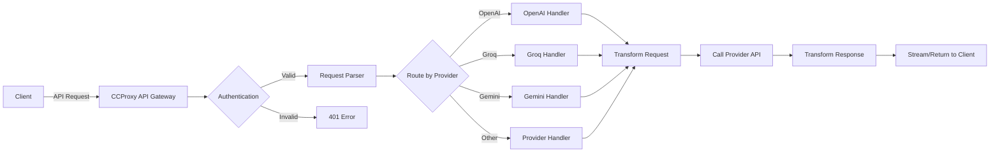

## Provider Architecture

Each provider follows a common interface pattern:

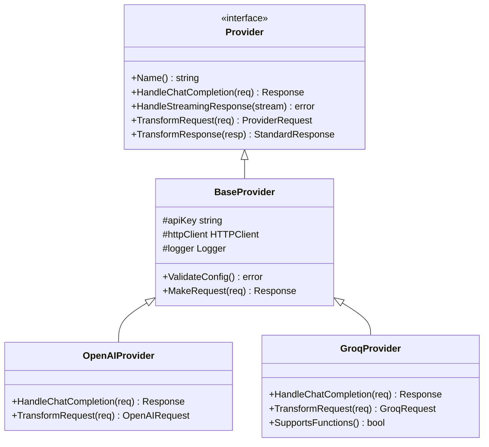

## Error Handling Flow

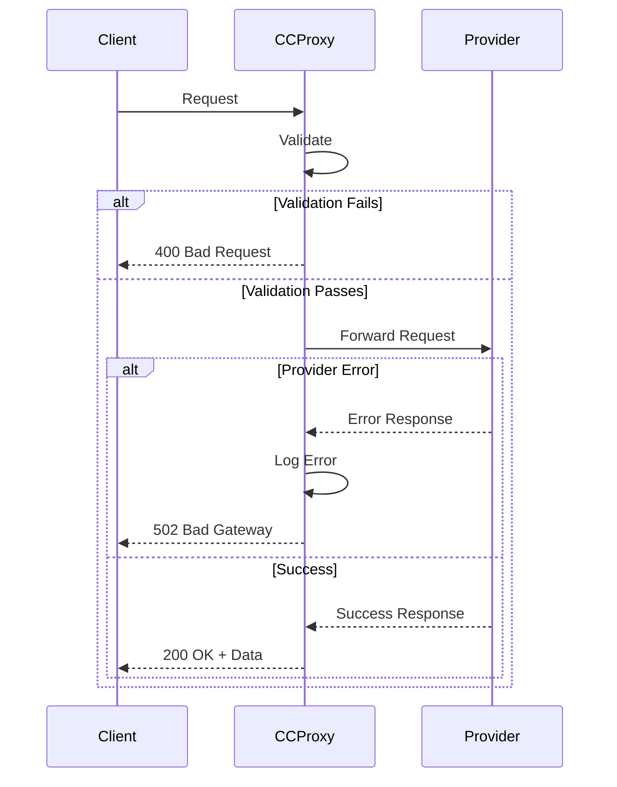

## Streaming Response Architecture

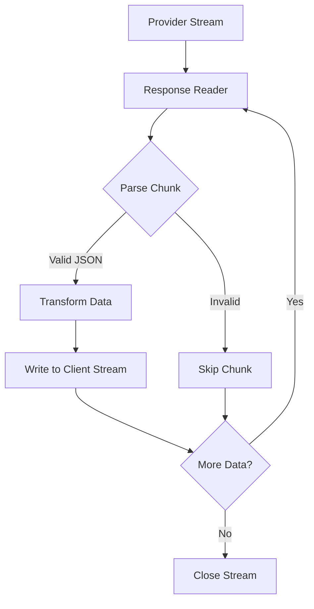

## Load Balancing Strategy

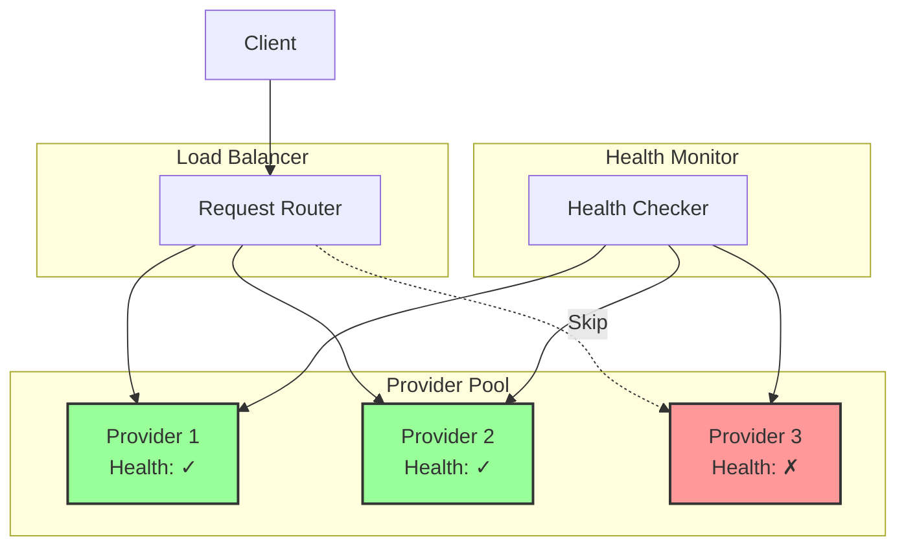

## Core Components

### Security Manager

Coordinates all security operations:

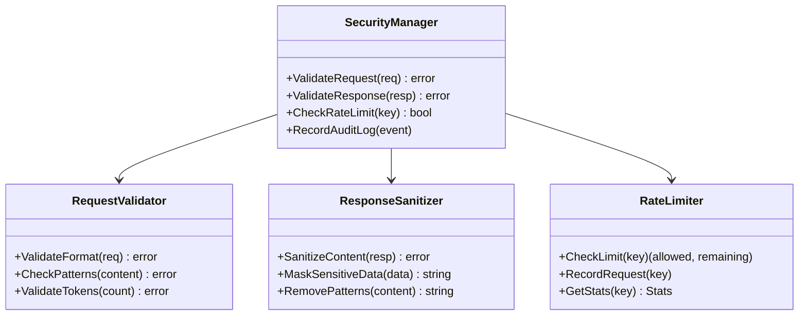

### Performance Monitor

Tracks system performance metrics:

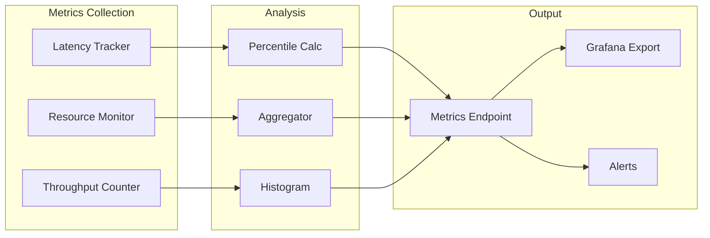

### State Management

Manages service and component states:

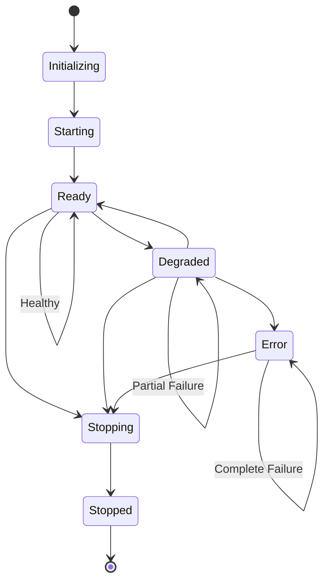

### Event System

Event-driven architecture for extensibility:

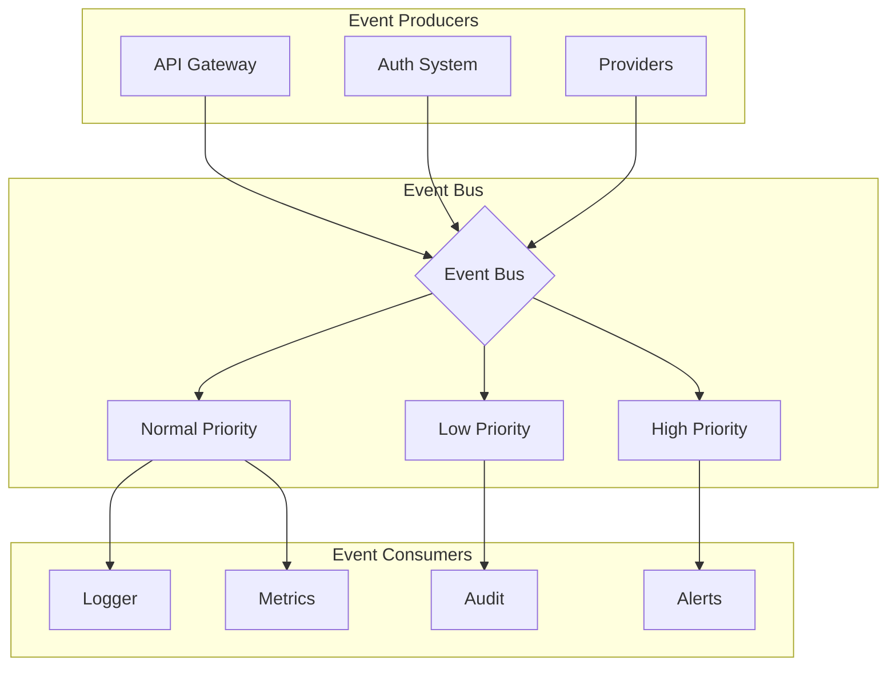

## Testing Architecture

### Test Framework Components

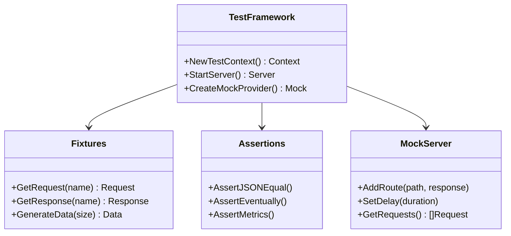

## Build and Deployment

### CI/CD Pipeline

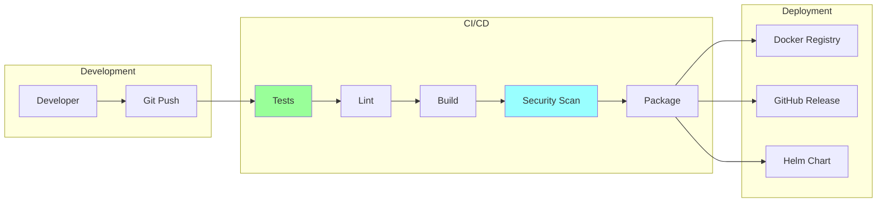