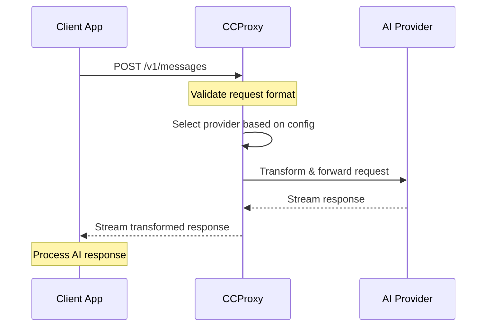

# API Reference

CCProxy provides a RESTful API that's fully compatible with Anthropic's Messages API, plus additional endpoints for health monitoring and status checking.

<SocialShare />

## Base URL

```
http://localhost:3456
```

## Authentication

CCProxy doesn't require authentication for the proxy functionality. The authentication is handled at the provider level using API keys configured via environment variables.

## Endpoints Overview

| Endpoint | Method | Purpose |
|----------|--------|---------|
| `/v1/messages` | POST | Main proxy endpoint (Anthropic compatible) |
| `/health` | GET | Detailed health check |
| `/status` | GET | Provider status and configuration |
| `/` | GET | Basic health check |

## API Flow Diagram



## Content Types

All endpoints accept and return `application/json` unless otherwise specified.

## Error Handling

CCProxy uses standard HTTP status codes and returns errors in a consistent format:

```json
{
  "error": {
    "type": "invalid_request_error",
    "message": "Description of the error"
  }
}
```

### Common Error Codes

| Code | Meaning | Description |
|------|---------|-------------|
| `400` | Bad Request | Invalid request format or parameters |
| `401` | Unauthorized | Provider API key is invalid |
| `429` | Too Many Requests | Rate limit exceeded |
| `500` | Internal Server Error | Server error or provider unavailable |
| `502` | Bad Gateway | Provider returned an error |
| `503` | Service Unavailable | CCProxy or provider is down |

## Provider Rate Limits

CCProxy is a local proxy and doesn't impose any rate limits. However, the underlying providers (Groq, OpenAI, etc.) may have their own rate limits which will be passed through as errors.

## Request/Response Format

### Request Headers

```http
Content-Type: application/json
Accept: application/json
```

### Response Headers

```http
Content-Type: application/json
X-Request-ID: uuid-v4-string
X-Provider: groq
X-Model: llama-3.1-70b-versatile
```

## Logging

CCProxy provides structured JSON logging for all requests:

```json
{
  "level": "info",
  "msg": "API action",
  "type": "api_action",
  "action": "anthropic_request",
  "request_id": "123e4567-e89b-12d3-a456-426614174000",
  "provider": "groq",
  "model": "claude-3-sonnet",
  "messages": 2,
  "tools": 1,
  "max_tokens": 1000,
  "time": "2025-01-17T10:30:00.000Z"
}
```

## Usage Examples

### Basic Text Request

```bash
curl -X POST http://localhost:3456/v1/messages \
  -H "Content-Type: application/json" \
  -d '{
    "model": "claude-3-sonnet",
    "messages": [
      {
        "role": "user",
        "content": "Hello, how are you?"
      }
    ],
    "max_tokens": 100
  }'
```

### Request with Tools

```bash
curl -X POST http://localhost:3456/v1/messages \
  -H "Content-Type: application/json" \
  -d '{
    "model": "claude-3-sonnet",
    "messages": [
      {
        "role": "user",
        "content": "What's the weather like in San Francisco?"
      }
    ],
    "tools": [
      {
        "name": "get_weather",
        "description": "Get current weather",
        "input_schema": {
          "type": "object",
          "properties": {
            "location": {"type": "string"}
          }
        }
      }
    ],
    "max_tokens": 150
  }'
```

### Health Check

```bash
curl http://localhost:3456/health
```

### Status Check

```bash
curl http://localhost:3456/status
```

## Response Examples

### Successful Text Response

```json
{
  "id": "msg_123abc",
  "type": "message",
  "role": "assistant",
  "model": "groq/llama-3.1-70b-versatile",
  "content": [
    {
      "type": "text",
      "text": "Hello! I'm doing well, thank you for asking. How can I help you today?"
    }
  ],
  "stop_reason": "end_turn",
  "stop_sequence": null,
  "usage": {
    "input_tokens": 12,
    "output_tokens": 20
  }
}
```

### Tool Use Response

```json
{
  "id": "msg_456def",
  "type": "message", 
  "role": "assistant",
  "model": "groq/llama-3.1-70b-versatile",
  "content": [
    {
      "type": "tool_use",
      "id": "call_123",
      "name": "get_weather",
      "input": {
        "location": "San Francisco"
      }
    }
  ],
  "stop_reason": "tool_use",
  "stop_sequence": null,
  "usage": {
    "input_tokens": 25,
    "output_tokens": 15
  }
}
```

### Error Response

```json
{
  "error": {
    "type": "invalid_request_error",
    "message": "Missing required field: messages"
  }
}
```

## SDKs and Libraries

CCProxy is compatible with any Anthropic SDK by simply changing the base URL:

### Python (anthropic)

```python
import anthropic

client = anthropic.Anthropic(
    api_key="NOT_NEEDED",  # CCProxy doesn't need this
    base_url="http://localhost:3456"
)

response = client.messages.create(
    model="claude-3-sonnet",
    messages=[{"role": "user", "content": "Hello!"}],
    max_tokens=100
)
```

### Node.js (@anthropic-ai/sdk)

```javascript
import Anthropic from '@anthropic-ai/sdk';

const client = new Anthropic({
    apiKey: 'NOT_NEEDED',
    baseURL: 'http://localhost:3456'
});

const response = await client.messages.create({
    model: 'claude-3-sonnet',
    messages: [{ role: 'user', content: 'Hello!' }],
    max_tokens: 100
});
```

### cURL

```bash
curl -X POST http://localhost:3456/v1/messages \
  -H "Content-Type: application/json" \
  -d '{
    "model": "claude-3-sonnet",
    "messages": [{"role": "user", "content": "Hello!"}],
    "max_tokens": 100
  }'
```

## Supported Features

### ✅ Fully Supported
- Text messages
- System messages  
- Tool/function calling
- Multi-turn conversations
- Streaming responses (when provider supports it)
- Custom max_tokens
- Temperature control
- All Anthropic message formats

### ⚠️ Provider Dependent
- Vision/image input (depends on provider)
- Real-time data access (XAI/Grok only)
- JSON mode (depends on provider)

### ❌ Not Supported
- Anthropic-specific features not available in OpenAI format
- Custom headers beyond what providers support

## Next Steps

- [Messages Endpoint](/api/messages) - Detailed API documentation
- [Health Endpoints](/api/health) - Monitoring and status
- [Claude Code Integration](/api/claude) - Setup guide