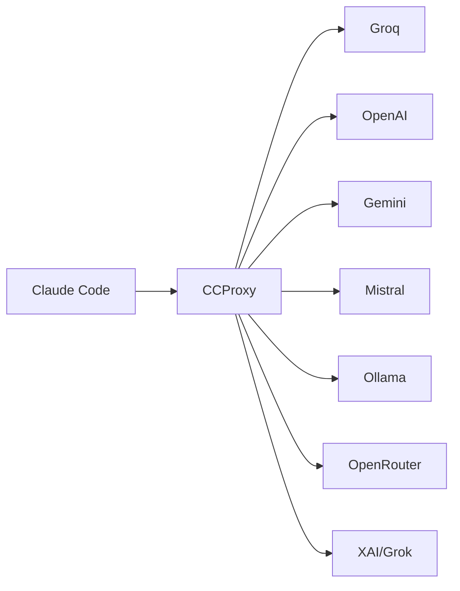

# Introduction

CCProxy is a high-performance, multi-provider AI proxy specifically designed to work seamlessly with Claude Code. It enables you to use any supported AI provider while maintaining perfect compatibility with Claude Code's Anthropic API interface.

<SocialShare />

## What is CCProxy?

CCProxy acts as a translation layer between Claude Code and various AI providers. When Claude Code makes requests to what it thinks is the Anthropic API, CCProxy intercepts these requests, converts them to the appropriate format for your chosen provider, and then converts the responses back to Anthropic's format.



## Key Features

### 🔄 **Perfect Format Conversion**
- Converts Anthropic API requests to OpenAI format
- Handles complex message structures including tool calls
- Maintains full compatibility with Claude Code features

### 🛠️ **Full Tool Support**
- Function calling works across all providers
- Tool use and tool results properly handled
- Consistent behavior regardless of provider

### ⚡ **High Performance**
- Built in Go for maximum speed
- Minimal latency overhead
- Efficient request/response processing

### 🏗️ **Production Ready**
- Comprehensive error handling
- Health monitoring endpoints
- Structured logging
- Docker support

## Supported Providers

| Provider | Status | Models | Special Features |
|----------|--------|--------|------------------|
| **Groq** | ✅ | Llama, Mixtral, Gemma | Ultra-fast inference |
| **OpenRouter** | ✅ | 100+ models | Model routing & fallbacks |
| **OpenAI** | ✅ | GPT-4o, GPT-4 Turbo | Industry standard |
| **XAI (Grok)** | ✅ | Grok-beta | Real-time data access |
| **Google Gemini** | ✅ | Gemini 2.0 Flash/Pro | Google's latest models |
| **Mistral AI** | ✅ | Large, Medium, Small | European AI excellence |
| **Ollama** | ✅ | Local models | Privacy & offline usage |

## How It Works

1. **Claude Code** makes a request to `http://localhost:3456/v1/messages`
2. **CCProxy** receives the Anthropic-format request
3. **CCProxy** converts it to the target provider's format
4. **Provider** processes the request and returns a response  
5. **CCProxy** converts the response back to Anthropic format
6. **Claude Code** receives the response as if it came from Claude

## Getting Started

Ready to get started? Check out our [Quick Start Guide](/guide/quick-start) to set up CCProxy in minutes.

## Architecture

CCProxy is designed with a modular architecture:

```
┌─────────────────┐
│   HTTP Server   │  ← Gin-based HTTP server
└─────────────────┘
         │
┌─────────────────┐
│    Handlers     │  ← Request/response handling
└─────────────────┘
         │
┌─────────────────┐
│   Converter     │  ← Anthropic ↔ OpenAI format conversion
└─────────────────┘
         │
┌─────────────────┐
│ Provider Factory│  ← Provider selection and creation
└─────────────────┘
         │
┌─────────────────┐
│   Providers     │  ← Individual provider implementations
└─────────────────┘
```

Each provider implements a common interface, making it easy to add new providers or switch between them without code changes.