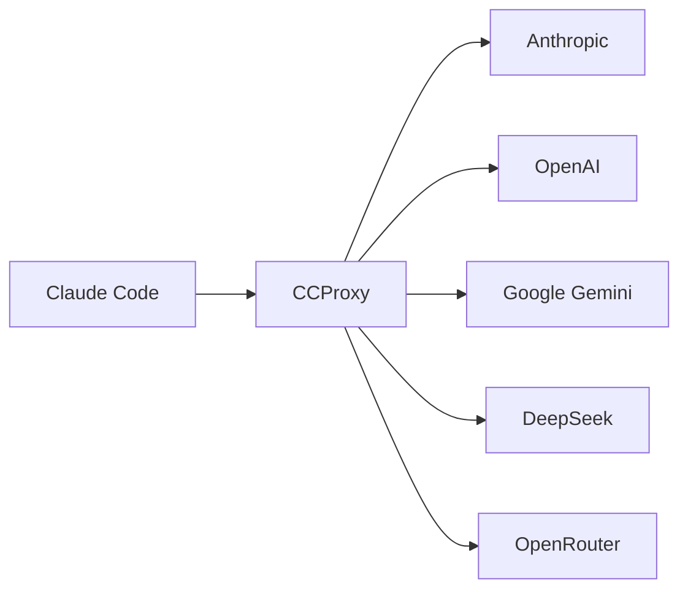

# Introduction

CCProxy is a high-performance Go-based API translation proxy that enables Claude Code to work with multiple AI providers. It acts as a middleware layer that translates Anthropic's API format to various provider-specific formats, enabling seamless integration without modifying Claude Code.

<SocialShare />

## What is CCProxy?

CCProxy is a **translation proxy** - it does not add new capabilities beyond API format translation. When Claude Code makes requests to what it thinks is the Anthropic API, CCProxy intercepts these requests, transforms them to the appropriate format for your chosen provider, and then transforms the responses back to Anthropic's format.



## Key Features

### 🔄 **API Translation**
- Transforms Anthropic API format to provider-specific formats
- Handles complex message structures including tool calls
- Maintains compatibility with Claude Code's expected responses

### 🛠️ **Function Calling Support**
- Full support for Anthropic and OpenAI providers
- Limited support for Gemini (may have compatibility issues)
- No support for DeepSeek (not recommended for Claude Code)
- OpenRouter support depends on the underlying model

### ⚡ **High Performance**
- Built in Go for maximum speed and efficiency
- <20MB memory usage, <100ms cold start
- Efficient streaming support for real-time responses

### 🏗️ **Production Ready**
- Comprehensive error handling and validation
- Health monitoring endpoints with authentication
- Process management with PID file locking
- Docker and Kubernetes support

## Implemented Providers

| Provider | Function Calling | Claude Code Compatibility | Notes |
|----------|------------------|---------------------------|-------|
| **Anthropic** | ✅ Full | ✅ Perfect | Native support, all features work |
| **OpenAI** | ✅ Full | ✅ Excellent | Most complete parameter support |
| **Google Gemini** | ⚠️ Limited | ⚠️ Limited | Function calling may have issues |
| **DeepSeek** | ❌ None | ❌ Not Compatible | No tool support, 8192 token limit |
| **OpenRouter** | Varies | Varies | Depends on selected model |

### OpenAI-Compatible Providers
These providers work through the OpenAI transformer by using OpenAI-compatible endpoints:

| Provider | Endpoint | Function Calling | Notes |
|----------|----------|------------------|-------|
| **Ollama** | `http://localhost:11434/v1` | ✅ Yes* | Local models, requires Ollama installation |
| **Groq** | `https://api.groq.com/openai/v1` | ✅ Yes | Ultra-fast inference, OpenAI-compatible |

*Function calling support depends on the specific model used (e.g., Llama 3.1 supports tools)

### Not Yet Implemented
The following providers would require dedicated transformers:
- Mistral AI
- XAI/Grok (if not using OpenAI-compatible mode)

## How It Works

1. **Claude Code** makes a request to `http://localhost:3456/v1/messages`
2. **CCProxy** receives the Anthropic-format request via its HTTP server
3. **Router** determines which provider and model to use based on routing rules
4. **Pipeline** processes the request through a chain of transformers
5. **Transformer** converts the request to the target provider's format
6. **Provider** processes the request and returns a response
7. **Transformer** converts the response back to Anthropic format
8. **Claude Code** receives the response as if it came from Claude

## Getting Started

Ready to get started? Check out our [Quick Start Guide](/guide/quick-start) to set up CCProxy in minutes.

## Architecture

CCProxy uses a pipeline-based architecture with pluggable transformers:

```
┌─────────────────┐
│   HTTP Server   │  ← Gin-based HTTP server with middleware
└─────────────────┘
         │
┌─────────────────┐
│     Router      │  ← Intelligent model routing based on rules
└─────────────────┘
         │
┌─────────────────┐
│    Pipeline     │  ← Request processing pipeline
└─────────────────┘
         │
┌─────────────────┐
│  Transformers   │  ← Chain of format transformers
└─────────────────┘
         │
┌─────────────────┐
│   Providers     │  ← Provider service for API calls
└─────────────────┘
```

### Key Components

- **Router**: Determines which provider/model to use based on token count, model type, and routing rules
- **Pipeline**: Orchestrates the request/response flow through transformers
- **Transformers**: Modular components that handle format conversion for each provider
- **Provider Service**: Manages API connections and health checks

### Routing Logic

CCProxy automatically routes requests based on:
- **Token count > 60K**: Routes to `longContext` configuration
- **Haiku models**: Routes to `background` configuration  
- **`thinking: true`**: Routes to `think` configuration
- **Direct model mapping**: Maps specific Anthropic models to any provider
- **Default**: Falls back to default route

## Security & Performance

### Security Features
- **API Key Authentication**: Optional CCProxy API key for access control
- **Localhost Enforcement**: When no API key is set, only localhost connections allowed
- **Request Size Limits**: Default 10MB limit to prevent DoS
- **Error Sanitization**: Provider error responses stripped of sensitive data
- **Process Isolation**: PID file locking prevents multiple instances

### Performance Features
- **Metrics Collection**: Request counts, latency tracking (P50, P95, P99)
- **Circuit Breaker**: Automatic failure detection and recovery
- **Configurable Timeouts**: Default 30s, prevents hanging requests
- **Efficient Memory Usage**: <20MB baseline, bounded caches
- **Connection Pooling**: Reuses HTTP connections to providers