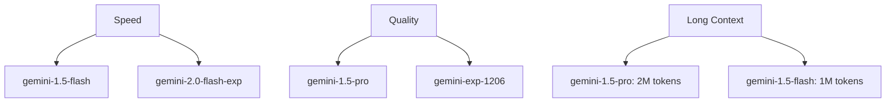

# Google Gemini Provider

Google's Gemini models offer advanced multimodal capabilities with strong performance across text, code, and vision tasks, backed by Google's cutting-edge AI research.

## Why Choose Google Gemini?

- 🎥 **Advanced multimodal**: Excellent vision and text understanding
- 🏗️ **Google's latest tech**: Cutting-edge AI from Google DeepMind
- 📊 **Strong analytics**: Excellent at data analysis and reasoning
- 💰 **Competitive pricing**: Good value for multimodal capabilities

## Setup

### 1. Get an API Key

1. Visit [aistudio.google.com](https://aistudio.google.com)
2. Sign up with your Google account
3. Navigate to "Get API key"
4. Generate a new API key

### 2. Configure CCProxy

Set the following environment variables:

```bash
export PROVIDER=gemini
export GEMINI_API_KEY=your_gemini_api_key_here
```

Alternative API key environment variables:
```bash
# Also supported
export GOOGLE_API_KEY=your_gemini_api_key_here
```

### 3. Optional Configuration

```bash
# Custom model (default: gemini-1.5-flash)
export GEMINI_MODEL=gemini-1.5-pro

# Custom max tokens (default: 16384)
export GEMINI_MAX_TOKENS=8192

# Custom base URL (default: https://generativelanguage.googleapis.com)
export GEMINI_BASE_URL=https://generativelanguage.googleapis.com
```

## Available Models

### Current Models

| Model | Context | Speed | Best For | Cost/1M tokens |
|-------|---------|-------|----------|----------------|
| **gemini-1.5-flash** | 1M | ⚡⚡⚡ | Fast responses (default) | $0.075/$0.30 |
| **gemini-1.5-pro** | 2M | ⚡⚡ | Complex tasks | $1.25/$5.00 |
| **gemini-1.0-pro** | 32K | ⚡⚡ | General use | $0.50/$1.50 |

### Experimental Models

| Model | Context | Speed | Best For | Cost/1M tokens |
|-------|---------|-------|----------|----------------|
| **gemini-2.0-flash-exp** | 1M | ⚡⚡⚡ | Latest features | $0.075/$0.30 |
| **gemini-exp-1206** | 2M | ⚡⚡ | Experimental | Varies |

### Model Capabilities



## Pricing

### Free Tier
Google AI Studio offers a generous free tier:
- **15 requests per minute**
- **1 million tokens per day**
- **1,500 requests per day**

### Paid Usage

| Model | Input | Output | Context |
|-------|-------|--------|---------|
| **gemini-1.5-flash** | $0.075 | $0.30 | 1M tokens |
| **gemini-1.5-pro** | $1.25 | $5.00 | 2M tokens |
| **gemini-1.0-pro** | $0.50 | $1.50 | 32K tokens |

*Prices per 1M tokens, subject to change*

## Configuration Examples

### Basic Setup

```bash
# .env file
PROVIDER=gemini
GEMINI_API_KEY=your_api_key_here
```

### High-Performance Setup

```bash
# For maximum speed
PROVIDER=gemini
GEMINI_API_KEY=your_api_key_here
GEMINI_MODEL=gemini-1.5-flash
GEMINI_MAX_TOKENS=4096
```

### Quality-Focused Setup

```bash
# For best quality and long context
PROVIDER=gemini
GEMINI_API_KEY=your_api_key_here
GEMINI_MODEL=gemini-1.5-pro
GEMINI_MAX_TOKENS=16384
```

### Experimental Setup

```bash
# For latest features
PROVIDER=gemini
GEMINI_API_KEY=your_api_key_here
GEMINI_MODEL=gemini-2.0-flash-exp
GEMINI_MAX_TOKENS=8192
```

## Usage with Claude Code

Once configured, use Claude Code normally:

```bash
# Set CCProxy as the API endpoint
export ANTHROPIC_BASE_URL=http://localhost:7187
export ANTHROPIC_API_KEY=NOT_NEEDED

# Use Claude Code
claude "Analyze this image and explain what you see"
```

## Features

### ✅ Fully Supported
- Text generation
- Function calling
- Tool use
- Streaming responses
- Vision/image input
- Long context (up to 2M tokens)
- JSON mode
- Custom temperature
- Multimodal understanding

### ⚠️ Model Dependent
- Real-time data access (limited)
- Code execution capabilities
- File uploads (vision models only)

### ❌ Not Supported
- Audio processing
- Video analysis (coming soon)

## Multimodal Capabilities

### Vision Understanding

Gemini excels at vision tasks:

```bash
# Image analysis
claude "What's in this image and what's the context?"

# Document analysis
claude "Extract and summarize the key information from this document"

# Chart and graph analysis
claude "Analyze this chart and explain the trends"
```

### Long Context Processing

With up to 2M tokens of context:

```bash
# Large document analysis
claude "Summarize this entire research paper"

# Multi-document comparison
claude "Compare these three reports and highlight differences"

# Code repository analysis
claude "Analyze this entire codebase and suggest improvements"
```

## Performance Tips

### 1. Choose the Right Model

```bash
# For speed and cost efficiency
export GEMINI_MODEL=gemini-1.5-flash

# For complex reasoning and long context
export GEMINI_MODEL=gemini-1.5-pro

# For latest experimental features
export GEMINI_MODEL=gemini-2.0-flash-exp
```

### 2. Optimize Token Usage

```bash
# Use appropriate max tokens for your use case
export GEMINI_MAX_TOKENS=2048  # For short responses
export GEMINI_MAX_TOKENS=8192  # For detailed analysis
```

### 3. Leverage Multimodal Features

```bash
# Combine text and image analysis
# Use long context for comprehensive analysis
# Take advantage of the generous free tier
```

## Advanced Features

### Function Calling

Gemini has robust function calling capabilities:

```json
{
  "tools": [
    {
      "name": "get_weather",
      "description": "Get current weather",
      "input_schema": {
        "type": "object",
        "properties": {
          "location": {"type": "string"}
        }
      }
    }
  ]
}
```

### JSON Mode

Force structured JSON responses:

```bash
# Gemini supports JSON mode for structured outputs
# Automatically enabled when using tools
```

### Safety Settings

Gemini includes built-in safety filters:

- Harassment detection
- Hate speech filtering
- Sexually explicit content blocking
- Dangerous content prevention

## Use Cases

### 1. Document Analysis

```bash
# Legal document review
claude "Analyze this contract and highlight key terms"

# Research paper summarization
claude "Summarize the key findings from this research"
```

### 2. Data Analysis

```bash
# Chart analysis
claude "What trends do you see in this sales chart?"

# Statistical analysis
claude "Analyze this dataset and provide insights"
```

### 3. Code Understanding

```bash
# Code review
claude "Review this code and suggest improvements"

# Architecture analysis
claude "Analyze this system architecture and identify potential issues"
```

### 4. Creative Tasks

```bash
# Image-based creativity
claude "Create a story based on this image"

# Multimodal content creation
claude "Write a blog post about this infographic"
```

## Troubleshooting

### Rate Limit Errors

```json
{
  "error": {
    "message": "Quota exceeded",
    "type": "quota_exceeded"
  }
}
```

**Solution**: Wait for quota reset or upgrade to paid usage.

### API Key Errors

```json
{
  "error": {
    "message": "API key not valid",
    "type": "invalid_argument"
  }
}
```

**Solution**: Verify your API key is correct and has proper permissions.

### Model Not Found

```json
{
  "error": {
    "message": "Model not found",
    "type": "not_found"
  }
}
```

**Solution**: Check the available models in [Google AI Studio](https://aistudio.google.com).

### Content Safety Blocks

```json
{
  "error": {
    "message": "The request was blocked by safety filters",
    "type": "safety_error"
  }
}
```

**Solution**: Modify your content to comply with safety guidelines.

### Large Context Limits

```json
{
  "error": {
    "message": "Input too long",
    "type": "invalid_argument"
  }
}
```

**Solution**: Reduce input size or use a model with larger context window.

## Best Practices

### 1. Model Selection

```bash
# Use gemini-1.5-flash for most tasks (speed + cost)
# Use gemini-1.5-pro for complex analysis
# Try experimental models for cutting-edge features
```

### 2. Context Management

```bash
# Take advantage of long context windows
# Structure large inputs clearly
# Use appropriate chunking for very large documents
```

### 3. Multimodal Usage

```bash
# Combine text and image inputs effectively
# Use vision for document analysis
# Leverage charts and graphs analysis
```

### 4. Cost Optimization

```bash
# Start with the generous free tier
# Monitor usage in Google AI Studio
# Use gemini-1.5-flash for cost efficiency
```

## Integration Examples

### Python with Google SDK

```python
import google.generativeai as genai

# Configure to use CCProxy
genai.configure(
    api_key="NOT_NEEDED",
    client_options={"api_endpoint": "http://localhost:7187"}
)

model = genai.GenerativeModel('claude-3-sonnet')  # Maps to Gemini
response = model.generate_content("Explain quantum computing")
```

### Anthropic SDK via CCProxy

```python
import anthropic

client = anthropic.Anthropic(
    api_key="NOT_NEEDED",
    base_url="http://localhost:7187"
)

response = client.messages.create(
    model="claude-3-sonnet",  # Maps to Gemini
    messages=[{"role": "user", "content": "Hello!"}],
    max_tokens=100
)
```

## Monitoring

### Google AI Studio

Monitor usage at [aistudio.google.com](https://aistudio.google.com):

- Request counts and quotas
- Token usage
- Model performance
- Error rates

### CCProxy Monitoring

```bash
# Real-time logs
tail -f ccproxy.log | grep gemini

# Status endpoint
curl http://localhost:7187/status

# Health check with Gemini status
curl http://localhost:7187/health
```

## Comparison with Other Providers

### Strengths
- 🎯 Excellent multimodal capabilities
- 💰 Generous free tier
- 📏 Very long context windows
- 🔍 Strong at analysis tasks

### Considerations
- 🛡️ Strong safety filters (may block some content)
- 🚀 Newer ecosystem (fewer third-party tools)
- 🌐 Geographic availability varies

## Future Developments

Google is rapidly improving Gemini:

- Video understanding capabilities
- Enhanced reasoning models
- Better code generation
- Improved multimodal features

Stay updated at [ai.google.dev](https://ai.google.dev) and [aistudio.google.com](https://aistudio.google.com).

## Next Steps

- Explore [long context use cases](/guide/long-context)
- Learn about [multimodal capabilities](/guide/multimodal)
- Set up [usage monitoring](/guide/monitoring)
- Compare with [other providers](/providers/) for your specific needs