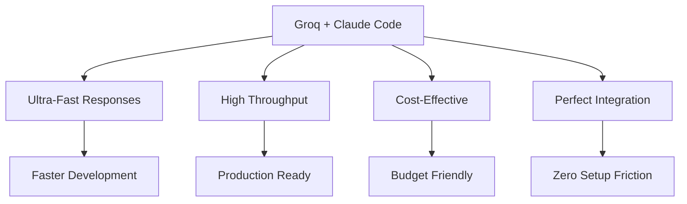

# Groq Provider

<div class="social-share">
  <button class="share-twitter" onclick="shareToTwitter()">
    🐦 Share on Twitter
  </button>
  <button class="share-linkedin" onclick="shareToLinkedIn()">
    💼 Share on LinkedIn
  </button>
  <button class="share-reddit" onclick="shareToReddit()">
    🔗 Share on Reddit
  </button>
  <button class="share-copy" onclick="copyToClipboard()">
    📋 Copy Link
  </button>
</div>

**Groq revolutionizes AI development** with ultra-fast inference speeds through their groundbreaking LPU (Language Processing Unit) technology. When combined with **Claude Code and CCProxy**, Groq delivers an unmatched development experience with **sub-second response times** and access to high-performance models.

## 🚀 Why Choose Groq for Claude Code?

- ⚡ **Ultra-fast inference**: Sub-second response times with LPU technology
- 🚀 **High-performance models**: Access to optimized models for speed
- 💰 **Cost-effective**: Competitive pricing with generous free tier
- 🎯 **Simple API**: Easy integration with Claude Code via CCProxy
- 🔄 **High throughput**: Excellent for high-volume AI development workflows
- 🚀 **Perfect Claude Code integration**: Seamless compatibility with zero configuration changes

## Setup

### 1. Get an API Key

1. Visit [console.groq.com](https://console.groq.com)
2. Sign up for a free account
3. Navigate to the API Keys section
4. Generate a new API key

### 2. Configure CCProxy

Set the following environment variables:

```bash
export PROVIDER=groq
export GROQ_API_KEY=gsk_your_groq_api_key_here
```

### 3. Optional Configuration

```bash
# Custom model (check console.groq.com for available models)
export GROQ_MODEL=your_preferred_model

# Custom max tokens (default: 16384)
export GROQ_MAX_TOKENS=8192

# Custom base URL (default: https://api.groq.com/openai/v1)
export GROQ_BASE_URL=https://api.groq.com/openai/v1
```

## Available Models

Groq provides access to various high-performance models optimized for speed:

- **Llama Models** - Meta's open-source models with excellent performance
- **Mixtral Models** - Mistral's mixture-of-experts models for specialized tasks
- **Gemma Models** - Google's efficient models for fast inference
- **Other Models** - Various specialized models for different use cases

**🔧 Critical for Claude Code**: You must select models that support **tool calling** or **function calling** capabilities, as Claude Code requires these features to operate correctly.

### Model Selection Guidelines

When choosing models on Groq:

1. **Verify Tool Support**: Ensure the model supports function calling
2. **Check Current Availability**: Groq's model lineup changes frequently
3. **Consider Speed vs Quality**: Balance inference speed with output quality
4. **Review Context Limits**: Different models have different context windows

For current model availability, capabilities, and pricing, visit [Groq's official console](https://console.groq.com).

## 🚀 Groq Performance Advantages

Groq's LPU technology delivers exceptional performance for Claude Code users:

- **Sub-second inference**: Experience the fastest AI responses for development
- **High throughput**: Excellent for high-volume development workflows
- **Claude Code optimized**: Seamless integration with your existing workflow
- **Cost-effective**: Competitive pricing with generous free tier
- **Zero configuration**: Works instantly with CCProxy - just set environment variables

### Performance Benefits



## Pricing

Groq offers competitive pricing with a generous free tier:

### Free Tier
- Generous daily request limits
- No upfront costs
- Perfect for development and testing

### Paid Tiers
- Higher rate limits for production use
- Competitive per-token pricing
- Volume discounts available

For current, accurate pricing information, visit [Groq's official console](https://console.groq.com).

## Configuration Examples

### Basic Setup

```bash
# .env file
PROVIDER=groq
GROQ_API_KEY=gsk_your_api_key_here
```

### High-Performance Setup

```bash
# For maximum speed (check console.groq.com for fast models)
PROVIDER=groq
GROQ_API_KEY=gsk_your_api_key_here
GROQ_MODEL=your_fast_model_choice
GROQ_MAX_TOKENS=4096
```

### Quality-Focused Setup

```bash
# For best quality (check console.groq.com for capable models)
PROVIDER=groq
GROQ_API_KEY=gsk_your_api_key_here
GROQ_MODEL=your_quality_model_choice
GROQ_MAX_TOKENS=16384
```

## Usage with Claude Code

Once configured, use Claude Code normally:

```bash
# Set CCProxy as the API endpoint
export ANTHROPIC_BASE_URL=http://localhost:7187
export ANTHROPIC_API_KEY=NOT_NEEDED

# Use Claude Code
claude "Explain quantum computing in simple terms"
```

## Features

### ✅ Supported
- Text generation
- Function calling
- Tool use
- Streaming responses
- JSON mode
- Custom temperature/top_p

### ❌ Not Supported
- Vision/image input
- File uploads
- Real-time data access

## Performance Tips

### 1. Choose the Right Model
- Check [console.groq.com](https://console.groq.com) for available models
- Select models based on your speed vs quality needs
- Ensure chosen models support function calling for Claude Code

### 2. Optimize Token Usage
```bash
# Reduce max tokens for faster responses
export GROQ_MAX_TOKENS=1024
```

### 3. Batch Requests
If making multiple requests, consider batching them to stay within rate limits.

## Troubleshooting

### Rate Limit Errors
```json
{
  "error": {
    "message": "Rate limit exceeded",
    "type": "rate_limit_error"
  }
}
```

**Solution**: Wait and retry, or upgrade to a paid plan for higher limits.

### Authentication Errors
```json
{
  "error": {
    "message": "Invalid API key",
    "type": "authentication_error"
  }
}
```

**Solution**: Verify your API key is correct and hasn't expired.

### Model Not Found
```json
{
  "error": {
    "message": "Model not found",
    "type": "invalid_request_error"
  }
}
```

**Solution**: Check the model name against the available models list above.

## Advanced Configuration

### Custom Headers
```bash
# Add custom headers for tracking
export GROQ_SITE_URL=https://yourapp.com
export GROQ_SITE_NAME="Your App Name"
```

### Timeout Settings
```bash
# Increase timeout for long requests
export GROQ_TIMEOUT=120s
```

## Monitoring

Check Groq usage and performance:

```bash
# View CCProxy logs
tail -f ccproxy.log

# Check status endpoint
curl http://localhost:7187/status
```

## Next Steps

- Explore [other providers](/providers/) for different use cases
- Learn about [configuration options](/guide/configuration)
- Set up [health monitoring](/guide/health-checks) for production
- Compare [performance benchmarks](/guide/monitoring) across providers

<script>
function shareToTwitter() {
  const url = encodeURIComponent(window.location.href);
  const text = encodeURIComponent('🚀 Groq + Claude Code + CCProxy = Ultra-fast AI development! Experience sub-second inference with LPU technology');
  window.open(`https://twitter.com/intent/tweet?url=${url}&text=${text}`, '_blank');
}

function shareToLinkedIn() {
  const url = encodeURIComponent(window.location.href);
  window.open(`https://www.linkedin.com/sharing/share-offsite/?url=${url}`, '_blank');
}

function shareToReddit() {
  const url = encodeURIComponent(window.location.href);
  const title = encodeURIComponent('Groq with Claude Code - Ultra-Fast AI Inference via CCProxy');
  window.open(`https://reddit.com/submit?url=${url}&title=${title}`, '_blank');
}

function copyToClipboard() {
  navigator.clipboard.writeText(window.location.href).then(() => {
    const button = event.target;
    const originalText = button.textContent;
    button.textContent = '✅ Copied!';
    setTimeout(() => {
      button.textContent = originalText;
    }, 2000);
  });
}
</script>