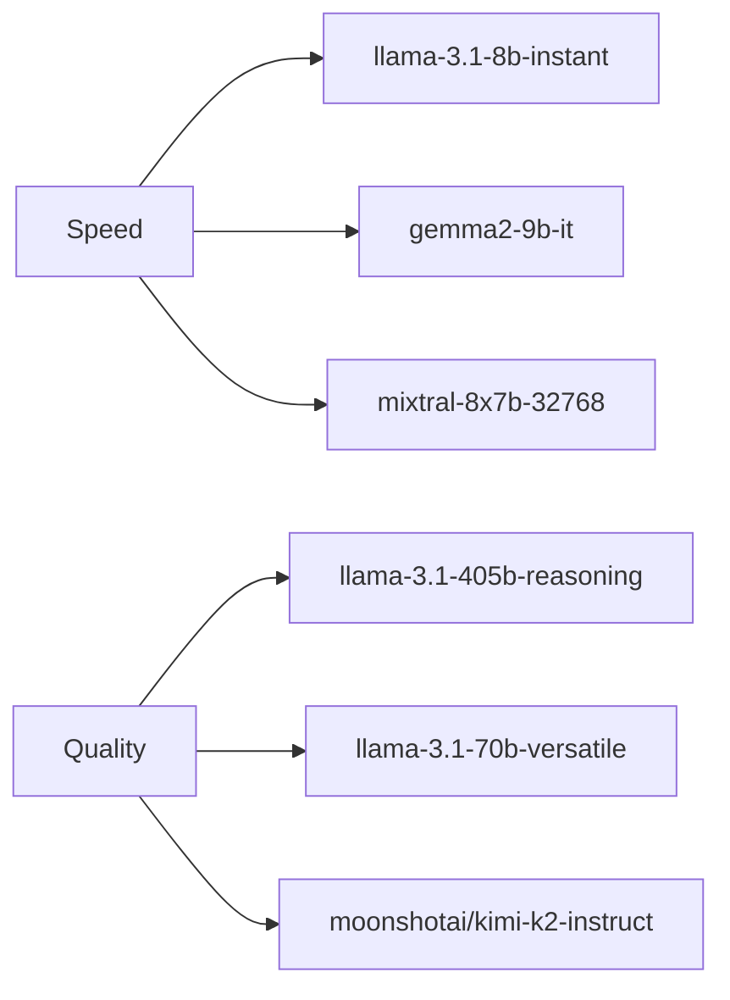

# Groq Provider

Groq is known for its ultra-fast inference speeds, making it an excellent choice for development and production workloads that require quick responses.

## Why Choose Groq?

- ⚡ **Ultra-fast inference**: Sub-second response times
- 💰 **Cost-effective**: Competitive pricing with generous free tier
- 🎯 **Simple API**: Easy to use and integrate
- 🔄 **High throughput**: Excellent for high-volume applications

## Setup

### 1. Get an API Key

1. Visit [console.groq.com](https://console.groq.com)
2. Sign up for a free account
3. Navigate to the API Keys section
4. Generate a new API key

### 2. Configure CCProxy

Set the following environment variables:

```bash
export PROVIDER=groq
export GROQ_API_KEY=gsk_your_groq_api_key_here
```

### 3. Optional Configuration

```bash
# Custom model (default: moonshotai/kimi-k2-instruct)
export GROQ_MODEL=llama-3.1-70b-versatile

# Custom max tokens (default: 16384)
export GROQ_MAX_TOKENS=8192

# Custom base URL (default: https://api.groq.com/openai/v1)
export GROQ_BASE_URL=https://api.groq.com/openai/v1
```

## Available Models

| Model | Context | Speed | Best For |
|-------|---------|-------|----------|
| **moonshotai/kimi-k2-instruct** | 128K | ⚡⚡⚡ | General use (default) |
| **llama-3.1-405b-reasoning** | 128K | ⚡⚡ | Complex reasoning |
| **llama-3.1-70b-versatile** | 128K | ⚡⚡⚡ | Balanced performance |
| **llama-3.1-8b-instant** | 128K | ⚡⚡⚡ | Fast responses |
| **mixtral-8x7b-32768** | 32K | ⚡⚡⚡ | Code and math |
| **gemma2-9b-it** | 8K | ⚡⚡⚡ | Efficient inference |

### Model Performance



## Pricing

Groq offers competitive pricing with a generous free tier:

| Tier | Requests/Day | Requests/Minute | Tokens/Minute |
|------|--------------|-----------------|---------------|
| **Free** | 14,400 | 30 | 6,000 |
| **Pay-as-you-go** | Unlimited | 30 | 6,000 |
| **Pro** | Unlimited | 6,000 | 6,000,000 |

### Cost per 1M Tokens

| Model | Input | Output |
|-------|-------|--------|
| Llama 3.1 8B | $0.05 | $0.08 |
| Llama 3.1 70B | $0.59 | $0.79 |
| Llama 3.1 405B | $2.70 | $2.70 |
| Mixtral 8x7B | $0.24 | $0.24 |

## Configuration Examples

### Basic Setup

```bash
# .env file
PROVIDER=groq
GROQ_API_KEY=gsk_your_api_key_here
```

### High-Performance Setup

```bash
# For maximum speed
PROVIDER=groq
GROQ_API_KEY=gsk_your_api_key_here
GROQ_MODEL=llama-3.1-8b-instant
GROQ_MAX_TOKENS=4096
```

### Quality-Focused Setup

```bash
# For best quality
PROVIDER=groq
GROQ_API_KEY=gsk_your_api_key_here
GROQ_MODEL=llama-3.1-405b-reasoning
GROQ_MAX_TOKENS=16384
```

## Usage with Claude Code

Once configured, use Claude Code normally:

```bash
# Set CCProxy as the API endpoint
export ANTHROPIC_BASE_URL=http://localhost:7187
export ANTHROPIC_API_KEY=NOT_NEEDED

# Use Claude Code
claude "Explain quantum computing in simple terms"
```

## Features

### ✅ Supported
- Text generation
- Function calling
- Tool use
- Streaming responses
- JSON mode
- Custom temperature/top_p

### ❌ Not Supported
- Vision/image input
- File uploads
- Real-time data access

## Performance Tips

### 1. Choose the Right Model
- Use `llama-3.1-8b-instant` for speed
- Use `llama-3.1-405b-reasoning` for quality
- Use `mixtral-8x7b-32768` for code tasks

### 2. Optimize Token Usage
```bash
# Reduce max tokens for faster responses
export GROQ_MAX_TOKENS=1024
```

### 3. Batch Requests
If making multiple requests, consider batching them to stay within rate limits.

## Troubleshooting

### Rate Limit Errors
```json
{
  "error": {
    "message": "Rate limit exceeded",
    "type": "rate_limit_error"
  }
}
```

**Solution**: Wait and retry, or upgrade to a paid plan for higher limits.

### Authentication Errors
```json
{
  "error": {
    "message": "Invalid API key",
    "type": "authentication_error"
  }
}
```

**Solution**: Verify your API key is correct and hasn't expired.

### Model Not Found
```json
{
  "error": {
    "message": "Model not found",
    "type": "invalid_request_error"
  }
}
```

**Solution**: Check the model name against the available models list above.

## Advanced Configuration

### Custom Headers
```bash
# Add custom headers for tracking
export GROQ_SITE_URL=https://yourapp.com
export GROQ_SITE_NAME="Your App Name"
```

### Timeout Settings
```bash
# Increase timeout for long requests
export GROQ_TIMEOUT=120s
```

## Monitoring

Check Groq usage and performance:

```bash
# View CCProxy logs
tail -f ccproxy.log

# Check status endpoint
curl http://localhost:7187/status
```

## Next Steps

- Explore [other providers](/providers/) for different use cases
- Learn about [configuration options](/guide/configuration)
- Set up [health monitoring](/guide/health-checks) for production