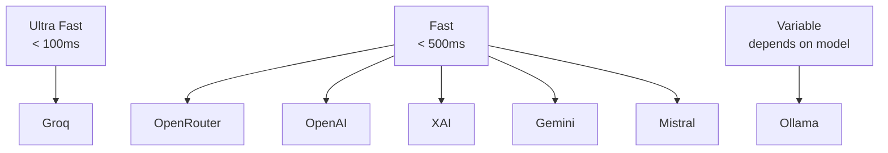

# Supported Providers

CCProxy supports 7 major AI providers, each with unique strengths and characteristics. This page provides an overview of all supported providers.

## Provider Overview

| Provider | Speed | Cost | Models | Use Case |
|----------|-------|------|--------|----------|
| **[Groq](/providers/groq)** | ⚡⚡⚡ | 💰 | 15+ | Ultra-fast inference |
| **[OpenRouter](/providers/openrouter)** | ⚡⚡ | 💰💰 | 100+ | Model diversity |
| **[OpenAI](/providers/openai)** | ⚡⚡ | 💰💰💰 | 10+ | Industry standard |
| **[XAI (Grok)](/providers/xai)** | ⚡⚡ | 💰💰 | 3+ | Real-time data |
| **[Google Gemini](/providers/gemini)** | ⚡⚡ | 💰💰 | 5+ | Multimodal AI |
| **[Mistral AI](/providers/mistral)** | ⚡⚡ | 💰💰 | 8+ | European choice |
| **[Ollama](/providers/ollama)** | ⚡ | 🆓 | 50+ | Local & private |

## Quick Setup

Each provider requires different setup steps. Here's the minimal configuration for each:

::: code-group

```bash [Groq]
export PROVIDER=groq
export GROQ_API_KEY=gsk_your_key_here
```

```bash [OpenRouter]
export PROVIDER=openrouter
export OPENROUTER_API_KEY=sk-or-v1-your_key_here
```

```bash [OpenAI]
export PROVIDER=openai
export OPENAI_API_KEY=sk-your_key_here
```

```bash [XAI (Grok)]
export PROVIDER=xai
export XAI_API_KEY=xai-your_key_here
```

```bash [Google Gemini]
export PROVIDER=gemini
export GEMINI_API_KEY=your_key_here
```

```bash [Mistral AI]
export PROVIDER=mistral
export MISTRAL_API_KEY=your_key_here
```

```bash [Ollama]
export PROVIDER=ollama
export OLLAMA_MODEL=llama3.2
# Requires Ollama running locally
```

:::

## Provider Comparison

### Performance & Speed



### Cost Comparison

| Provider | Input (1M tokens) | Output (1M tokens) | Free Tier |
|----------|-------------------|-------------------|-----------|
| **Groq** | $0.05 - $0.27 | $0.27 - $0.27 | ✅ Generous |
| **OpenRouter** | $0.06 - $5.00 | $0.06 - $15.00 | ✅ Limited |
| **OpenAI** | $0.15 - $10.00 | $0.60 - $30.00 | ✅ Limited |
| **XAI** | $5.00 | $15.00 | ❌ |
| **Gemini** | $0.075 - $1.25 | $0.30 - $5.00 | ✅ Generous |
| **Mistral** | $0.25 - $2.00 | $0.25 - $6.00 | ❌ |
| **Ollama** | $0.00 | $0.00 | ✅ Unlimited |

*Prices are approximate and may vary by model and usage patterns.*

### Model Capabilities

| Provider | Text | Code | Function Calls | Vision | Reasoning |
|----------|------|------|---------------|--------|-----------|
| **Groq** | ✅ | ✅ | ✅ | ❌ | ✅ |
| **OpenRouter** | ✅ | ✅ | ✅ | ✅ | ✅ |
| **OpenAI** | ✅ | ✅ | ✅ | ✅ | ✅ |
| **XAI** | ✅ | ✅ | ✅ | ✅ | ✅ |
| **Gemini** | ✅ | ✅ | ✅ | ✅ | ✅ |
| **Mistral** | ✅ | ✅ | ✅ | ❌ | ✅ |
| **Ollama** | ✅ | ✅ | ✅ | ✅* | ✅ |

*Depends on specific model

## Provider Selection Guide

### Choose **Groq** if you want:
- ⚡ Fastest possible inference speeds
- 💰 Cost-effective pricing
- 🆓 Generous free tier
- 📊 Simple, reliable service

### Choose **OpenRouter** if you want:
- 🎯 Access to 100+ different models
- 🔄 Model routing and fallbacks
- 🧪 Experimentation with cutting-edge models
- 📈 Usage analytics

### Choose **OpenAI** if you want:
- 🏭 Industry-standard models
- 🛠️ Extensive tooling and ecosystem
- 👁️ Advanced vision capabilities
- 🎯 Proven reliability

### Choose **XAI (Grok)** if you want:
- 📰 Real-time information access
- 🐦 X/Twitter integration
- 🆕 Cutting-edge capabilities
- 🚀 Elon Musk's AI vision

### Choose **Google Gemini** if you want:
- 🎥 Advanced multimodal capabilities
- 🏗️ Google's latest technology
- 📊 Strong analytical capabilities
- 🔍 Integration with Google services

### Choose **Mistral AI** if you want:
- 🇪🇺 European AI alternative
- 🔒 Strong privacy focus
- 💼 Enterprise-grade features
- 🎯 Multilingual excellence

### Choose **Ollama** if you want:
- 🔒 Complete privacy (local processing)
- 🌐 Offline capabilities
- 💸 Zero ongoing costs
- 🎛️ Full control over your models

## Getting Started

1. **Pick a provider** based on your needs
2. **Get an API key** from the provider's website
3. **Configure CCProxy** with your chosen provider
4. **Start coding** with Claude Code!

Ready to dive deeper? Click on any provider above to see detailed setup instructions, model lists, and configuration options.