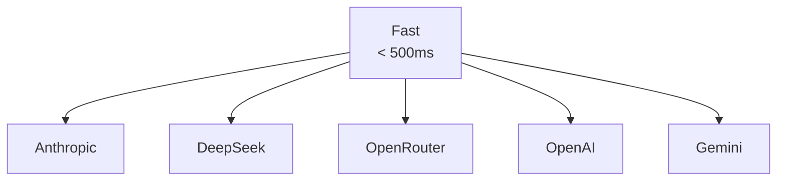

# Supported Providers

CCProxy supports multiple AI providers through two methods: dedicated transformers and OpenAI-compatible endpoints. This page provides an overview of all supported providers.

## How CCProxy Works

CCProxy uses a **transformer-based architecture** to translate API requests between Claude Code (which uses Anthropic's API format) and various AI providers. Instead of implementing direct provider clients, CCProxy uses transformers that:

1. **Receive** requests in Anthropic's API format
2. **Transform** them to the target provider's format
3. **Forward** the transformed request to the provider
4. **Transform** the response back to Anthropic's format
5. **Return** the response to Claude Code

This architecture allows CCProxy to remain lightweight while supporting multiple providers.

## Native Provider Support

These providers have dedicated transformer implementations:

| Provider | Speed | Cost | Models | Use Case | Transformer Status |
|----------|-------|------|--------|----------|-------------------|
| **[Anthropic](/providers/anthropic)** | ⚡⚡⚡ | 💰💰💰 | 4+ | Best reasoning & coding | ✅ Full transformer |
| **[OpenAI](/providers/openai)** | ⚡⚡ | 💰💰💰 | 10+ | Industry standard | ✅ Full transformer |
| **[Google Gemini](/providers/gemini)** | ⚡⚡ | 💰💰 | 5+ | Multimodal AI | ✅ Transformer (limited tools) |
| **[DeepSeek](/providers/deepseek)** | ⚡⚡ | 💰💰 | 3+ | Advanced reasoning | ✅ Transformer (no tools) |
| **[OpenRouter](/providers/openrouter)** | ⚡⚡ | 💰💰 | 100+ | Model diversity | ✅ Pass-through transformer |

## OpenAI-Compatible Providers

These providers work through the OpenAI transformer using OpenAI-compatible endpoints:

| Provider | Speed | Cost | Models | Use Case | Tool Support |
|----------|-------|------|--------|----------|--------------|
| **[Ollama](/providers/ollama)** | ⚡⚡⚡ | 💰 | 20+ | Local/private AI | ✅ Model dependent |
| **[Groq](/providers/groq)** | ⚡⚡⚡⚡ | 💰💰 | 8+ | Ultra-fast inference | ✅ Full support |

**Note**: OpenAI-compatible providers use `"openai"` as the provider name in configuration but with different API base URLs.

## Quick Setup

CCProxy uses a JSON configuration file. Here's the minimal configuration for each provider:

::: code-group

```json [Anthropic]
{
  "providers": [{
    "name": "anthropic",
    "api_base_url": "https://api.anthropic.com/v1",
    "api_key": "sk-ant-your_key_here",
    "models": ["claude-sonnet-4-20250720", "claude-opus-4-20250720"],
    "enabled": true
  }],
  "routes": {
    "default": {
      "provider": "anthropic",
      "model": "claude-sonnet-4-20250720"
    }
  }
}
```


```json [OpenRouter]
{
  "providers": [{
    "name": "openrouter",
    "api_base_url": "https://openrouter.ai/api/v1",
    "api_key": "sk-or-v1-your_key_here",
    "models": ["anthropic/claude-3.5-sonnet", "google/gemini-pro-1.5"],
    "enabled": true
  }],
  "routes": {
    "default": {
      "provider": "openrouter",
      "model": "anthropic/claude-3.5-sonnet"
    }
  }
}
```

```json [OpenAI]
{
  "providers": [{
    "name": "openai",
    "api_base_url": "https://api.openai.com/v1",
    "api_key": "sk-your_key_here",
    "models": ["gpt-4", "gpt-3.5-turbo"],
    "enabled": true
  }],
  "routes": {
    "default": {
      "provider": "openai",
      "model": "gpt-4"
    }
  }
}
```


```json [Google Gemini]
{
  "providers": [{
    "name": "gemini",
    "api_base_url": "https://generativelanguage.googleapis.com/v1",
    "api_key": "your_key_here",
    "models": ["gemini-1.5-pro", "gemini-1.5-flash"],
    "enabled": true
  }],
  "routes": {
    "default": {
      "provider": "gemini",
      "model": "gemini-1.5-pro"
    }
  }
}
```


```json [DeepSeek]
{
  "providers": [{
    "name": "deepseek",
    "api_base_url": "https://api.deepseek.com/v1",
    "api_key": "your_key_here",
    "models": ["deepseek-chat", "deepseek-reasoner", "deepseek-coder-v2"],
    "enabled": true
  }],
  "routes": {
    "default": {
      "provider": "deepseek",
      "model": "deepseek-chat"
    },
    "think": {
      "provider": "deepseek",
      "model": "deepseek-reasoner"
    }
  }
}
```

```json [Ollama]
{
  "providers": [{
    "name": "openai",
    "api_base_url": "http://localhost:11434/v1",
    "api_key": "ollama",
    "models": ["llama3.1", "codellama", "mistral"],
    "enabled": true
  }],
  "routes": {
    "default": {
      "provider": "openai",
      "model": "llama3.1"
    }
  }
}
```

```json [Groq]
{
  "providers": [{
    "name": "openai",
    "api_base_url": "https://api.groq.com/openai/v1",
    "api_key": "gsk_your_groq_api_key",
    "models": ["llama-3.1-70b-versatile", "llama-3.1-8b-instant"],
    "enabled": true
  }],
  "routes": {
    "default": {
      "provider": "openai",
      "model": "llama-3.1-70b-versatile"
    }
  }
}
```

:::

**Important Note**: In each configuration above:
- The `models` array lists available models for validation
- The `routes` section defines which model actually handles requests
- You must define at least a `default` route for CCProxy to work

## Provider Comparison

### Performance & Speed



### Cost Comparison

| Provider | Free Tier | Pricing Model | Best For |
|----------|-----------|---------------|----------|
| **Anthropic** | ❌ | Pay-per-use | Complex reasoning & coding |
| **DeepSeek** | ✅ Limited | Pay-per-use | Advanced reasoning |
| **OpenRouter** | ✅ Limited | Pay-per-use | Model variety |
| **OpenAI** | ✅ Limited | Pay-per-use | Enterprise reliability |
| **Gemini** | ✅ Generous | Pay-per-use | Multimodal tasks |

For current pricing information, visit each provider's official pricing page.

### Model Capabilities

| Provider | Text | Code | Function Calling | Vision | Reasoning | Claude Code Compatible |
|----------|------|------|-----------------|--------|-----------|----------------------|
| **Anthropic** | ✅ | ✅ | ✅ | ✅ | ✅ | ✅ Full Support |
| **OpenAI** | ✅ | ✅ | ✅ | ✅ | ✅ | ✅ Full Support |
| **Gemini** | ✅ | ✅ | ⚠️ | ✅ | ✅ | ⚠️ Limited support |
| **DeepSeek** | ✅ | ✅ | ❌ | ❌ | ✅✅ | ⚠️ Limited (no tools) |
| **OpenRouter** | ✅ | ✅ | ✅* | ✅* | ✅ | ✅ Model dependent |
| **Ollama** | ✅ | ✅ | ✅** | ❌ | ✅ | ✅ Model dependent |
| **Groq** | ✅ | ✅ | ✅ | ❌ | ✅ | ✅ Full Support |

*Depends on specific model routed through OpenRouter
**Depends on specific model (e.g., Llama 3.1 supports tools)

## Important: Tool Calling Requirement

**⚠️ Critical for Claude Code Users**: You must select models that support **tool calling** or **function calling** capabilities, as Claude Code requires these features to operate correctly. 

### Provider Tool Support Status:
- **Anthropic**: ✅ Full tool/function calling support - **Recommended for Claude Code**
- **OpenAI**: ✅ Full function calling support - **Recommended for Claude Code**  
- **OpenRouter**: ✅ Supports tools (model-dependent) - **Check specific model capabilities**
- **DeepSeek**: ❌ No tool support in transformer - **NOT recommended for Claude Code**
- **Google Gemini**: ⚠️ Limited tool support - **May have compatibility issues with Claude Code**

For best Claude Code compatibility, use Anthropic or OpenAI providers with models that explicitly support function calling.

## Provider Selection Guide

### Choose **Anthropic** if you want:
- 🧠 Best-in-class reasoning capabilities
- 💻 Superior coding performance (SWE-bench 72.5%)
- 📚 Long context window support (200K tokens)
- 🤔 Advanced thinking mode for complex problems


### Choose **OpenRouter** if you want:
- 🎯 Access to 100+ different models
- 🔄 Model routing and fallbacks
- 🧪 Experimentation with cutting-edge models
- 📈 Usage analytics

### Choose **OpenAI** if you want:
- 🏭 Industry-standard models
- 🛠️ Extensive tooling and ecosystem
- 👁️ Advanced vision capabilities
- 🎯 Proven reliability


### Choose **Google Gemini** if you want:
- 🎥 Advanced multimodal capabilities
- 🏗️ Google's latest technology
- 📊 Strong analytical capabilities
- 🔍 Integration with Google services


### Choose **DeepSeek** if you want:
- 🧠 Exceptional reasoning capabilities (87.5% on AIME 2025)
- 🎯 45-50% less hallucination
- 💻 Specialized coding models
- 🔬 Advanced mathematical and scientific analysis

### Choose **Ollama** if you want:
- 🔒 Complete privacy - all processing happens locally
- 💰 Zero API costs - just your electricity
- 🌐 Offline capability after model download
- 🏠 Full control over your AI infrastructure

### Choose **Groq** if you want:
- ⚡ Ultra-fast inference (10-100x faster than GPUs)
- 🚀 Near-instant responses for real-time applications
- 🛠️ OpenAI-compatible API for easy integration
- 📊 High-throughput workloads


## Model Selection Guidelines

When selecting models from any provider:

1. **Verify Tool Calling Support**: Ensure the model supports function calling/tool use
2. **Check Current Availability**: Model availability changes frequently
3. **Review Pricing**: Visit the provider's official pricing page for current rates
4. **Test Performance**: Different models excel at different tasks

For current model lists, capabilities, and pricing, always check the provider's official documentation.

## Getting Started

1. **Pick a provider** based on your needs
2. **Get an API key** from the provider's website
3. **Configure CCProxy** with your chosen provider
4. **Start coding** with Claude Code!

Ready to dive deeper? Click on any provider above to see detailed setup instructions, model lists, and configuration options.