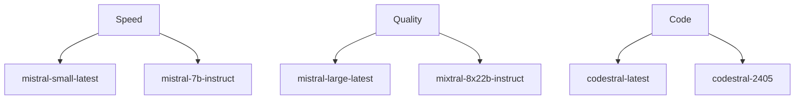

# Mistral AI Provider

Mistral AI offers high-quality European AI models with a strong focus on privacy, multilingual capabilities, and enterprise-grade features.

## Why Choose Mistral AI?

- 🇪🇺 **European AI**: Privacy-focused alternative to US providers
- 🌍 **Multilingual excellence**: Superior performance in non-English languages
- 💼 **Enterprise-grade**: Built for business and production use
- 🔒 **Privacy-focused**: Strong data protection and compliance

## Setup

### 1. Get an API Key

1. Visit [console.mistral.ai](https://console.mistral.ai)
2. Sign up for an account
3. Navigate to the API Keys section
4. Generate a new API key

### 2. Configure CCProxy

Set the following environment variables:

```bash
export PROVIDER=mistral
export MISTRAL_API_KEY=your_mistral_api_key_here
```

### 3. Optional Configuration

```bash
# Custom model (default: mistral-large-latest)
export MISTRAL_MODEL=mistral-small-latest

# Custom max tokens (default: 16384)
export MISTRAL_MAX_TOKENS=8192

# Custom base URL (default: https://api.mistral.ai/v1)
export MISTRAL_BASE_URL=https://api.mistral.ai/v1
```

## Available Models

### Current Models

| Model | Context | Speed | Best For | Cost/1M tokens |
|-------|---------|-------|----------|----------------|
| **mistral-large-latest** | 128K | ⚡⚡ | Complex tasks (default) | $2.00/$6.00 |
| **mistral-small-latest** | 128K | ⚡⚡⚡ | Fast responses | $0.20/$0.60 |
| **codestral-latest** | 32K | ⚡⚡ | Code generation | $0.25/$0.75 |
| **mistral-medium-latest** | 32K | ⚡⚡ | Balanced performance | $0.70/$2.10 |

### Specialized Models

| Model | Specialty | Context | Cost/1M tokens |
|-------|-----------|---------|----------------|
| **codestral-2405** | Code & Tech | 32K | $0.25/$0.75 |
| **mistral-7b-instruct** | Lightweight | 32K | $0.25/$0.25 |
| **mixtral-8x7b-instruct** | Multi-expert | 32K | $0.70/$0.70 |
| **mixtral-8x22b-instruct** | Large multi-expert | 64K | $2.00/$6.00 |

### Model Performance



## Pricing

### No Free Tier
Mistral AI operates on a pay-as-you-use model with no free tier.

### Pricing Structure

| Model | Input | Output |
|-------|-------|--------|
| **mistral-large-latest** | $2.00 | $6.00 |
| **mistral-small-latest** | $0.20 | $0.60 |
| **mistral-medium-latest** | $0.70 | $2.10 |
| **codestral-latest** | $0.25 | $0.75 |
| **mixtral-8x7b-instruct** | $0.70 | $0.70 |
| **mixtral-8x22b-instruct** | $2.00 | $6.00 |

*Prices per 1M tokens, subject to change*

## Configuration Examples

### Basic Setup

```bash
# .env file
PROVIDER=mistral
MISTRAL_API_KEY=your_api_key_here
```

### High-Performance Setup

```bash
# For maximum speed
PROVIDER=mistral
MISTRAL_API_KEY=your_api_key_here
MISTRAL_MODEL=mistral-small-latest
MISTRAL_MAX_TOKENS=4096
```

### Quality-Focused Setup

```bash
# For best quality
PROVIDER=mistral
MISTRAL_API_KEY=your_api_key_here
MISTRAL_MODEL=mistral-large-latest
MISTRAL_MAX_TOKENS=16384
```

### Code-Focused Setup

```bash
# For coding tasks
PROVIDER=mistral
MISTRAL_API_KEY=your_api_key_here
MISTRAL_MODEL=codestral-latest
MISTRAL_MAX_TOKENS=8192
```

## Usage with Claude Code

Once configured, use Claude Code normally:

```bash
# Set CCProxy as the API endpoint
export ANTHROPIC_BASE_URL=http://localhost:7187
export ANTHROPIC_API_KEY=NOT_NEEDED

# Use Claude Code
claude "Écrivez un script Python pour analyser des données CSV"
```

## Features

### ✅ Fully Supported
- Text generation
- Function calling
- Tool use
- Streaming responses
- JSON mode
- Custom temperature/top_p
- Multilingual support
- Code generation
- Long context (up to 128K)

### ❌ Not Supported
- Vision/image input
- Real-time data access
- File uploads
- Audio processing

## Unique Strengths

### Multilingual Excellence

Mistral models excel at non-English languages:

```bash
# French
claude "Expliquez l'intelligence artificielle en français"

# Spanish  
claude "Explica el aprendizaje automático en español"

# German
claude "Erkläre maschinelles Lernen auf Deutsch"

# Italian
claude "Spiega l'intelligenza artificiale in italiano"
```

### Code Generation

Codestral models are specialized for code:

```bash
# Use Codestral for programming tasks
export MISTRAL_MODEL=codestral-latest

# Generate complex code
claude "Create a REST API in Python with authentication"

# Code review and optimization
claude "Review this JavaScript code and suggest improvements"
```

### Enterprise Features

- **Data residency**: European data processing
- **Compliance**: GDPR-compliant by design
- **Privacy**: No data retention for API usage
- **Security**: Enterprise-grade security measures

## Performance Tips

### 1. Choose the Right Model

```bash
# For general tasks
export MISTRAL_MODEL=mistral-large-latest

# For speed and cost efficiency
export MISTRAL_MODEL=mistral-small-latest

# For coding
export MISTRAL_MODEL=codestral-latest

# For complex reasoning
export MISTRAL_MODEL=mixtral-8x22b-instruct
```

### 2. Optimize for Multilingual Use

```bash
# Specify language in prompts for better results
claude "Please respond in French: ..."

# Use native language prompts
claude "En français, expliquez..."
```

### 3. Leverage Long Context

```bash
# Use up to 128K tokens for large documents
export MISTRAL_MAX_TOKENS=16384

# Analyze large codebases or documents
claude "Analyze this entire repository and suggest improvements"
```

## Use Cases

### 1. Multilingual Applications

```bash
# Customer support in multiple languages
claude "Respond to this customer inquiry in their native language"

# Content translation and localization
claude "Translate and adapt this content for European markets"
```

### 2. Code Development

```bash
# Use Codestral for development
export MISTRAL_MODEL=codestral-latest

# Generate API documentation
claude "Create comprehensive API documentation for this code"

# Refactor legacy code
claude "Modernize this legacy Python code using current best practices"
```

### 3. Enterprise Analysis

```bash
# Business intelligence
claude "Analyze this quarterly report and identify key trends"

# Compliance checking
claude "Review this contract for GDPR compliance issues"
```

### 4. Research and Academic

```bash
# Academic writing in multiple languages
claude "Write an academic abstract in German about AI ethics"

# Research analysis
claude "Summarize these research papers and identify common themes"
```

## Troubleshooting

### Authentication Errors

```json
{
  "error": {
    "message": "Invalid API key",
    "type": "authentication_error"
  }
}
```

**Solution**: Verify your Mistral API key is correct and active.

### Rate Limit Errors

```json
{
  "error": {
    "message": "Rate limit exceeded", 
    "type": "rate_limit_error"
  }
}
```

**Solution**: Implement retry logic or upgrade to higher tier if available.

### Model Not Available

```json
{
  "error": {
    "message": "Model not found",
    "type": "invalid_request_error"
  }
}
```

**Solution**: Check available models at [console.mistral.ai](https://console.mistral.ai).

### Context Length Exceeded

```json
{
  "error": {
    "message": "Input too long",
    "type": "invalid_request_error"
  }
}
```

**Solution**: Reduce input size or use a model with larger context window.

### Payment Required

```json
{
  "error": {
    "message": "Insufficient credits",
    "type": "insufficient_quota"
  }
}
```

**Solution**: Add credits to your Mistral account (no free tier available).

## Best Practices

### 1. Model Selection Strategy

```bash
# Start with mistral-small-latest for development
# Use mistral-large-latest for production
# Use codestral-latest specifically for code tasks
# Consider mixtral models for complex reasoning
```

### 2. Multilingual Optimization

```bash
# Be explicit about target language
# Use native language prompts when possible
# Leverage Mistral's European language strength
```

### 3. Cost Management

```bash
# Monitor usage carefully (no free tier)
# Use smaller models for simple tasks
# Optimize prompts to reduce token usage
```

### 4. Enterprise Considerations

```bash
# Leverage European data residency
# Use for GDPR-compliant applications
# Take advantage of privacy-focused features
```

## Integration Examples

### Python SDK

```python
import anthropic

# Point to CCProxy
client = anthropic.Anthropic(
    api_key="NOT_NEEDED",
    base_url="http://localhost:7187"
)

response = client.messages.create(
    model="claude-3-sonnet",  # Maps to Mistral model
    messages=[{
        "role": "user", 
        "content": "Écrivez un programme Python pour analyser des données"
    }],
    max_tokens=1000
)
```

### Multilingual Content

```bash
# Generate content in multiple languages
claude "Create a product description in English, French, and German"

# Translate technical documentation
claude "Translate this API documentation to Spanish while preserving technical accuracy"
```

## Monitoring

### Mistral Console

Monitor usage at [console.mistral.ai](https://console.mistral.ai):

- API usage and costs
- Request patterns
- Model performance
- Error rates

### CCProxy Monitoring

```bash
# Real-time logs
tail -f ccproxy.log | grep mistral

# Status endpoint
curl http://localhost:7187/status

# Health check
curl http://localhost:7187/health
```

## Comparison with Other Providers

### Strengths
- 🇪🇺 European data residency and compliance
- 🌍 Superior multilingual capabilities
- 🔒 Strong privacy and security focus
- 💼 Enterprise-ready features

### Considerations
- 💸 No free tier (paid usage only)
- 👁️ No vision capabilities (text-only)
- 🌐 Smaller ecosystem compared to OpenAI

### When to Choose Mistral
- ✅ European/GDPR compliance requirements
- ✅ Multilingual applications
- ✅ Enterprise privacy needs
- ✅ High-quality code generation
- ✅ Non-English language tasks

## Future Developments

Mistral AI is actively developing:

- Enhanced multilingual models
- Improved code generation capabilities
- Potential vision model releases
- Enterprise features and integrations

Stay updated at [mistral.ai](https://mistral.ai) and [console.mistral.ai](https://console.mistral.ai).

## Next Steps

- Explore [multilingual use cases](/guide/multilingual)
- Learn about [code generation](/guide/code-generation) with Codestral
- Set up [enterprise monitoring](/guide/enterprise-monitoring)
- Compare [European vs US providers](/guide/provider-comparison) for compliance needs