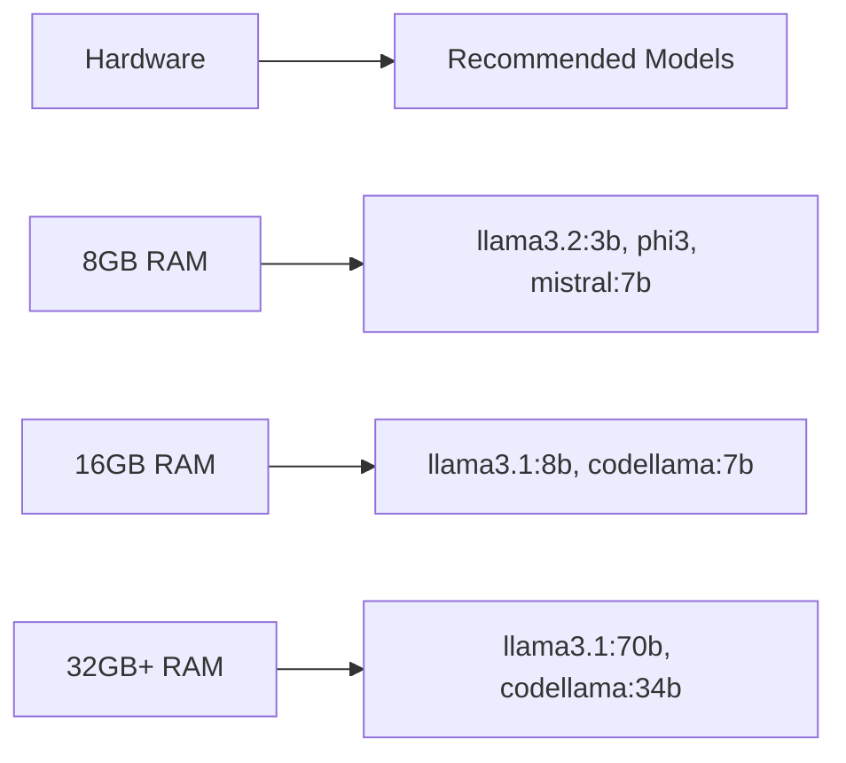

# Ollama Provider

<div class="social-share">
  <button class="share-twitter" onclick="shareToTwitter()">
    🐦 Share on Twitter
  </button>
  <button class="share-linkedin" onclick="shareToLinkedIn()">
    💼 Share on LinkedIn
  </button>
  <button class="share-reddit" onclick="shareToReddit()">
    🔗 Share on Reddit
  </button>
  <button class="share-copy" onclick="copyToClipboard()">
    📋 Copy Link
  </button>
</div>

**Ollama revolutionizes AI development** by enabling you to run large language models locally on your machine. Through **CCProxy integration with Claude Code**, you gain complete privacy, offline capabilities, and zero ongoing costs while maintaining the familiar Claude Code experience.

## 🔒 Why Choose Ollama for Claude Code?

- 🔒 **Complete privacy**: All AI processing happens locally with Claude Code integration
- 🌐 **Offline capabilities**: Full AI development without internet dependency
- 💸 **Zero ongoing costs**: No API fees or subscription charges - perfect for Claude Code users
- 🎛️ **Full control**: Choose your models and hardware while keeping Claude Code workflow
- 🏠 **Local sovereignty**: Your code and data never leave your machine
- ⚡ **Claude Code optimized**: Seamless local AI experience with familiar interface

## Setup

### 1. Install Ollama

First, install Ollama on your system:

#### macOS
```bash
# Download from ollama.ai or use Homebrew
brew install ollama
```

#### Linux
```bash
curl -fsSL https://ollama.ai/install.sh | sh
```

#### Windows
Download the installer from [ollama.ai](https://ollama.ai)

### 2. Start Ollama Service

```bash
# Start Ollama (runs on port 11434 by default)
ollama serve
```

### 3. Download a Model

```bash
# Download a recommended model
ollama pull llama3.2

# Or download other models
ollama pull mistral
ollama pull codellama
ollama pull phi3
```

### 4. Configure CCProxy

Set the following environment variables:

```bash
export PROVIDER=ollama
export OLLAMA_MODEL=llama3.2
```

### 5. Optional Configuration

```bash
# Custom base URL (default: http://localhost:11434)
export OLLAMA_BASE_URL=http://localhost:11434

# Custom max tokens (default: 16384)
export OLLAMA_MAX_TOKENS=8192
```

## Available Models

Ollama supports 50+ models across different categories:

- **Llama Series** - Meta's open-source models with excellent general performance
- **Code-Specialized Models** - Models optimized for programming tasks
- **Vision Models** - Models that can process both text and images
- **Multilingual Models** - Models optimized for non-English languages
- **Lightweight Models** - Smaller models for resource-constrained environments
- **Embedding Models** - Models for text embeddings and similarity

**🔧 Critical for Claude Code**: You must select models that support **tool calling** or **function calling** capabilities, as Claude Code requires these features to operate correctly.

### Model Selection Guidelines

When choosing Ollama models:

1. **Verify Tool Support**: Ensure the model supports function calling
2. **Check Hardware Requirements**: Match model size to your available RAM/GPU
3. **Consider Use Case**: Choose specialized models for specific tasks
4. **Test Performance**: Different models balance speed vs quality differently
5. **Review Context Limits**: Different models have different context windows

For current model availability and installation commands, visit [Ollama's official library](https://ollama.ai/library).

### Model Size Guide



## Configuration Examples

### Basic Setup

```bash
# .env file
PROVIDER=ollama
OLLAMA_MODEL=llama3.2
```

### High-Performance Setup

```bash
# For maximum speed (small model)
PROVIDER=ollama
OLLAMA_MODEL=llama3.2:3b
OLLAMA_MAX_TOKENS=4096
OLLAMA_BASE_URL=http://localhost:11434
```

### Quality-Focused Setup

```bash
# For best quality (if you have the hardware)
PROVIDER=ollama
OLLAMA_MODEL=llama3.1:70b
OLLAMA_MAX_TOKENS=16384
```

### Code-Focused Setup

```bash
# For coding tasks
PROVIDER=ollama
OLLAMA_MODEL=codellama:13b
OLLAMA_MAX_TOKENS=8192
```

### Vision-Enabled Setup

```bash
# For image understanding
PROVIDER=ollama
OLLAMA_MODEL=llava:13b
OLLAMA_MAX_TOKENS=4096
```

## Usage with Claude Code

Once configured, use Claude Code normally:

```bash
# Set CCProxy as the API endpoint
export ANTHROPIC_BASE_URL=http://localhost:7187
export ANTHROPIC_API_KEY=NOT_NEEDED

# Use Claude Code with local models
claude "Explain how neural networks work"
```

## Features

### ✅ Fully Supported
- Text generation
- Function calling
- Tool use
- Streaming responses
- Custom temperature/top_p
- Local processing
- Offline capabilities
- Multiple model management

### ⚠️ Model Dependent
- Vision/image input (llava models only)
- Code generation (specialized models)
- Multilingual support (depends on model)

### ❌ Not Supported
- Real-time data access
- Web browsing
- Audio processing
- File uploads (except images for vision models)

## Model Management

### Installing Models

```bash
# Install specific models
ollama pull llama3.2:3b      # 3B parameter version
ollama pull llama3.1:8b      # 8B parameter version  
ollama pull llama3.1:70b     # 70B parameter version

# Install code models
ollama pull codellama:7b
ollama pull deepseek-coder:6.7b

# Install vision models
ollama pull llava:7b
ollama pull llava:13b
```

### Managing Models

```bash
# List installed models
ollama list

# Remove a model
ollama rm llama3.1:70b

# Update a model
ollama pull llama3.2  # Downloads latest version

# Check model info
ollama show llama3.2
```

### Model Variants

Most models come in different sizes:

```bash
# Small (faster, less capable)
ollama pull llama3.2:3b

# Medium (balanced)
ollama pull llama3.1:8b

# Large (slower, more capable)
ollama pull llama3.1:70b
```

## Hardware Requirements

### Minimum Requirements

| Model Size | RAM | GPU VRAM | CPU |
|------------|-----|----------|-----|
| **3B models** | 8GB | 4GB | 4+ cores |
| **7B models** | 16GB | 8GB | 8+ cores |
| **13B models** | 32GB | 16GB | 8+ cores |
| **70B models** | 64GB+ | 48GB+ | 16+ cores |

### Performance Tips

```bash
# Check GPU support
ollama list  # Shows if models are running on GPU

# Monitor resource usage
htop  # CPU and RAM usage
nvidia-smi  # GPU usage (if NVIDIA)

# Optimize for your hardware
export OLLAMA_NUM_PARALLEL=2  # Parallel requests
export OLLAMA_MAX_LOADED_MODELS=2  # Loaded models
```

## Performance Optimization

### 1. Choose the Right Model Size

```bash
# For development (fast iterations)
export OLLAMA_MODEL=llama3.2:3b

# For production (quality balance)
export OLLAMA_MODEL=llama3.1:8b

# For complex tasks (if hardware allows)
export OLLAMA_MODEL=llama3.1:70b
```

### 2. Hardware Optimization

```bash
# Use GPU acceleration when available
# Ensure sufficient RAM for model size
# Use SSD storage for better model loading
```

### 3. Model Loading

```bash
# Pre-load models for faster responses
ollama run llama3.2  # Loads model into memory

# Keep frequently used models loaded
export OLLAMA_MAX_LOADED_MODELS=3
```

## Use Cases

### 1. Development and Testing

```bash
# Private development environment
claude "Help me debug this Python function"

# Code review without sending to external APIs
claude "Review this code for security issues"
```

### 2. Sensitive Data Processing

```bash
# Process confidential documents locally
claude "Analyze this confidential report"

# Handle proprietary code
claude "Refactor this proprietary algorithm"
```

### 3. Offline Work

```bash
# Work without internet connection
claude "Generate documentation for this API"

# Travel and remote work
claude "Help me with this presentation"
```

### 4. Cost-Conscious Applications

```bash
# High-volume processing without API costs
# Educational use without budget constraints
# Experimentation without usage limits
```

## Troubleshooting

### Ollama Service Not Running

```bash
# Start Ollama service
ollama serve

# Check if running
curl http://localhost:11434/api/tags
```

### Model Not Found

```bash
# List available models
ollama list

# Pull the model if not installed
ollama pull llama3.2
```

### Out of Memory Errors

```bash
# Use a smaller model
export OLLAMA_MODEL=llama3.2:3b

# Close other applications
# Consider upgrading RAM
```

### Slow Performance

```bash
# Check GPU availability
nvidia-smi  # For NVIDIA GPUs
ollama show llama3.2  # Shows GPU usage

# Use smaller model for speed
export OLLAMA_MODEL=phi3
```

### Connection Errors

```json
{
  "error": {
    "message": "Connection refused",
    "type": "connection_error"
  }
}
```

**Solution**: Ensure Ollama service is running on the correct port.

## Best Practices

### 1. Model Selection Strategy

```bash
# Start with llama3.2 for general use
# Use codellama for programming tasks
# Try llava for vision tasks
# Choose model size based on your hardware
```

### 2. Resource Management

```bash
# Monitor RAM and GPU usage
# Don't load too many large models simultaneously
# Close models you're not using
```

### 3. Development Workflow

```bash
# Use smaller models during development
# Switch to larger models for final processing
# Keep a fast model for quick iterations
```

### 4. Security and Privacy

```bash
# All data stays on your machine
# No external API calls or data transmission
# Perfect for sensitive or proprietary content
```

## Advanced Configuration

### Custom Model Creation

```bash
# Create custom models with Modelfile
echo 'FROM llama3.2
PARAMETER temperature 0.1
SYSTEM "You are a helpful coding assistant."' > Modelfile

ollama create my-code-model -f Modelfile
```

### Environment Variables

```bash
# Advanced Ollama configuration
export OLLAMA_HOST=0.0.0.0:11434  # Bind to all interfaces
export OLLAMA_MODELS=/custom/path  # Custom models directory
export OLLAMA_NUM_PARALLEL=4       # Parallel requests
export OLLAMA_MAX_LOADED_MODELS=3  # Keep multiple models loaded
```

### Docker Deployment

```bash
# Run Ollama in Docker
docker run -d -v ollama:/root/.ollama -p 11434:11434 --name ollama ollama/ollama

# With GPU support
docker run -d --gpus=all -v ollama:/root/.ollama -p 11434:11434 --name ollama ollama/ollama
```

## Monitoring

### System Monitoring

```bash
# Monitor Ollama service
curl http://localhost:11434/api/tags

# Check running models
curl http://localhost:11434/api/ps

# System resources
htop         # CPU and RAM
nvidia-smi   # GPU (if available)
```

### CCProxy Integration

```bash
# CCProxy logs
tail -f ccproxy.log | grep ollama

# Status endpoint
curl http://localhost:7187/status

# Health check
curl http://localhost:7187/health
```

## Comparison with Cloud Providers

### Advantages of Ollama
- 🔒 **Complete privacy**: No data leaves your machine
- 💸 **Zero ongoing costs**: No API fees
- 🌐 **Offline capable**: Works without internet
- 🎛️ **Full control**: Choose models and configurations

### Considerations
- 💻 **Hardware requirements**: Needs powerful local hardware
- 🐌 **Potential slower inference**: Depends on your hardware vs cloud GPUs
- 🔧 **Setup complexity**: Requires local installation and management
- 📦 **Model management**: Need to download and manage models locally

### When to Choose Ollama
- ✅ Privacy is critical
- ✅ Want to avoid ongoing API costs
- ✅ Need offline capabilities
- ✅ Have sufficient local hardware
- ✅ Want to experiment freely without usage limits

## Next Steps

- Install and try different models for various development tasks
- Learn about local privacy benefits for sensitive code and data
- Set up hardware optimization for best performance
- Explore custom model creation and local fine-tuning

<script>
function shareToTwitter() {
  const url = encodeURIComponent(window.location.href);
  const text = encodeURIComponent('🔒 Ollama + Claude Code + CCProxy = Privacy-first local AI development! Zero costs, complete privacy, offline capabilities');
  window.open(`https://twitter.com/intent/tweet?url=${url}&text=${text}`, '_blank');
}

function shareToLinkedIn() {
  const url = encodeURIComponent(window.location.href);
  window.open(`https://www.linkedin.com/sharing/share-offsite/?url=${url}`, '_blank');
}

function shareToReddit() {
  const url = encodeURIComponent(window.location.href);
  const title = encodeURIComponent('Ollama with Claude Code - Local Privacy-First AI via CCProxy');
  window.open(`https://reddit.com/submit?url=${url}&title=${title}`, '_blank');
}

function copyToClipboard() {
  navigator.clipboard.writeText(window.location.href).then(() => {
    const button = event.target;
    const originalText = button.textContent;
    button.textContent = '✅ Copied!';
    setTimeout(() => {
      button.textContent = originalText;
    }, 2000);
  });
}
</script>